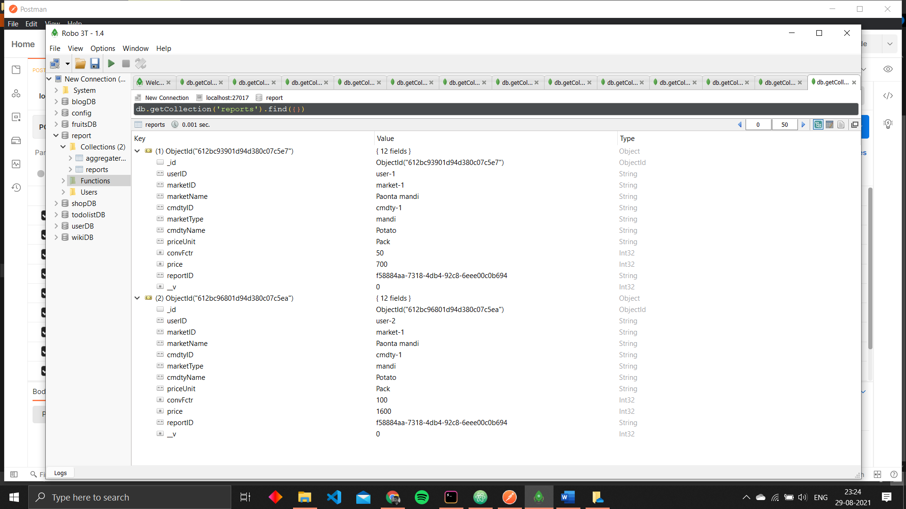
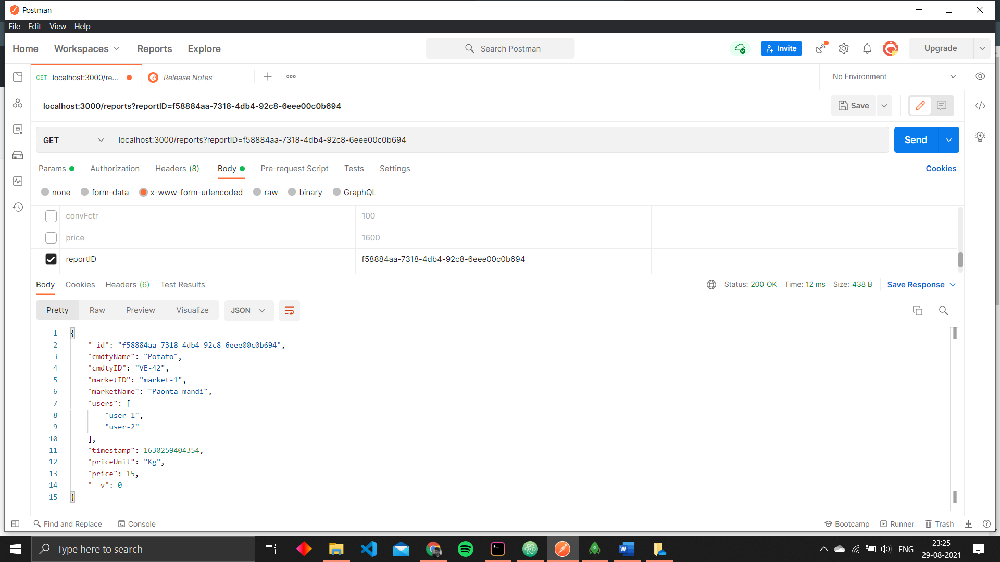

# agrilink-assignment-API
This project is is done under assignment from agrilink

Work of this API is to collect data send by different users of different markets reporting about
the price of different commodities . Hence forming a unique marketID-cmdtID pair for which unique reportID 
will be generated and this  reportID has to be send back to the users that they can enter this reportID
to check the aggregated report . Aggregated report is a report which contains mean of all the comodities
which come under specific reportID in Kg unit.

API Testing is done using POSTMAN

First user will use this API to SEND/POST report on the server from where a unique reportID will be send
back as RESPONSE

Now , 2nd user will use this API to SEND/POST report on the server from where a unique reportID will be send
back as RESPONSE

As you may have noted that reportID is same for user-1 and user-2 because they are reporting price of same commodities
from same market . Hence marketID-cmdtID reamins unique .

Our API is connected to mongoDb DataBase to collect all the report information and assign unique reportID to 
individual document 

User enters the reportID to check the Aggregate report 
So, server finds/GET the unique reportID for marketID-cmdtID pair and send to user as a response
and aggregate-report gets saved in database

Database of aggregate report

Code given in repository can also be use to obtain valid results for more tetscases other than the given default testcases . 

